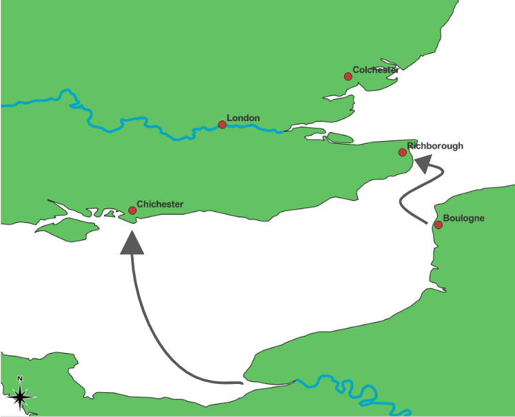

## Roman Britain Invasion

Roman emperor Claudius was the one who successfully lead an invasion into England. Julius Caesar had prepared for invasion before him, but it was Claudius who brought troops into England. They invaded around 43 CE and was a part of the Empire until the 5th century CE. Aulus Plautius was the Roman general in charge of the invasion. There are a couple different places where historians and archaeologists debate from where they embarked from to where they landed in Britain. The most widely accepted place of embarkation is Boulogne, and the other possible places are from the mouths of the Somme River and Seine River. The two places the could have landed were either Richborough or Chichester, and each of these places provided different military advancements.

***Richborough***:
If they landed in Richborough, then they took a short and more direct route to Colchester. They marched along the North Downs and crossed the Thames River near London. Then took over Colchester.

***Chichester***:
If they landed in Chichester then aim was to restore the Pro-Roman kingdom of the Atrebates in Southern Britain. Then travel North to the Thames River and down the valley into Catuvellauni territory. Then finally capturing Colchester with was the capital of the Catuvellauni.

Aulus Plautius summoned Claudius when they were about to deliver the final assault on Colchester. According to Cassio Dio Claudius arrived with his Praetorian cohorts and war elephants for it, and after 11 British Kings surrendered to Emperor Claudius.

## Roads

Roman roads were originally made for military purposes (functions). As the Romans started to expand their territory outside of Italy and into Europe, they needed a way to easily transport armies to gain and sustain newly claimed territories. This prompted the need to construct roads in Europe. In Italy there were already remnants of roads existing from the Greeks and Etruscans (RoadsintheRomanEmpire). These roads contributed to trade and communication routes. This is consistent in Britain as the initial roads connected London to the invasion ports, Richborough and Chichester. Then from there they were connected to the forts to sustain military communication lines and easy army mobility between them. As they progressed through Britain more roads started to extend out connecting forts and settlements to the North up to Hadrian's Wall and to the West in modern day Wales.

 
