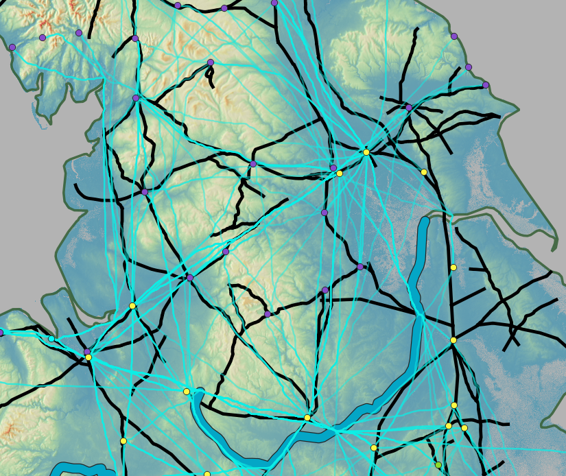
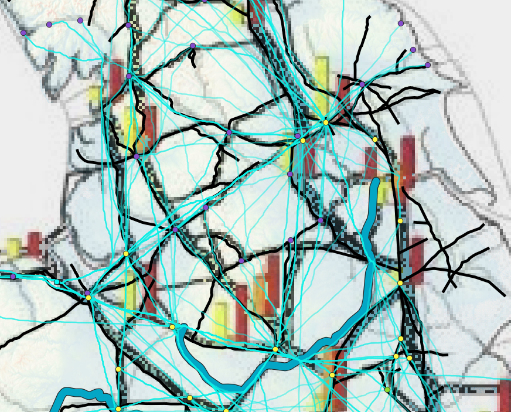
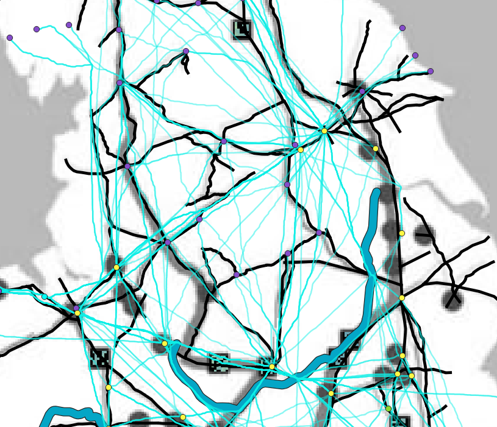

### Area of Interest

This area was selected to look into because these LCPs generated a route from East to West that was used by many LCPs. However, there does not seem to be a major road in this same area based on the roads with high betweenness found by Lewis and Orengo. Therefore, this section will take a closer look into why the LCPs generated by this project created this popular route and how it can relate to the other maps.

### Three Map View Points

|:-------------------------:|:-------------------------:|:-------------------------:|
|   View Topography of Area |   Orengo's Map |  Lewis' Map |

 

#### **View of the Least Cost Paths from a topographical standpoint**

<iframe width="600px" height="600px" src="https://mads709.github.io/3d-road-north.github.io/" title="map"></iframe>

These LCPs show a route that should be popularized and used more frequently because many LCPs follow this same route from West to East. There even appears to be a Roman road there, however when overlaid with Lewis’ and Orengo's maps there is not a road with a high betweenness score situated there. Other routes where there are LCPs that do not align with the roads with high betweenness scores from their research either. This has brought some conclusions about the LCPs in terms of the topography of the area. For instance the thick line going from Southwest on the map to Northeast displays a road that could be a main route and used frequently. This is because in that region, the terrain is more hill-like and has greater changes in elevation than in other areas. Therefore according to topography and the cost it would take to move across the land, this particular route is the best to take. This conclusion is entirely based on the topography of an area so it cannot allow for the conclusion that this was also an important road used by the Romans. That is where the research of Lewis and Orengo aids in determining whether this road was frequently used. This can tell us that if the Romans were to cross the land this route would have been the best route because it required the least amount of energy to walk across.

 

#### **View of the Least Cost Paths with the research from Lewis and Orengo**

These routes on the East and West side going North to South display a high betweenness score from Lewis’ research. This suggests for his research that these routes were frequent ones for transferring information. These routes are the same routes for Orengo’s maps as well, which display roads that were frequented for food transportation. From this cultural perspective these roads were some of the main routes used for transportation. However, the LCPs do not display this same conclusion. In those areas along those roads the LCPs do not follow the same route and instead they are more dispersed around the area all taking slightly different routes. Looking at the topographic map, it can be seen that these areas where the routes are located have less elevation change and are essentially flat terrain. The LCPs generated take the shortest distance between two points and if there is no terrain difficulty that would cause them to take a different route, it could essentially be a straight line from one point to another. Therefore the LCPs in those areas are not condensed into one route because the terrain is not an obstacle here. Meaning these roads were made important solely based on cultural impacts of trade, and communication. The topography of the area had no impact on the design of the routes for the roads because it was not an obstacle. Therefore, the only impact on the design of the roads would have been the best route for connecting these settlements, markets, and forts for trade and communication.
