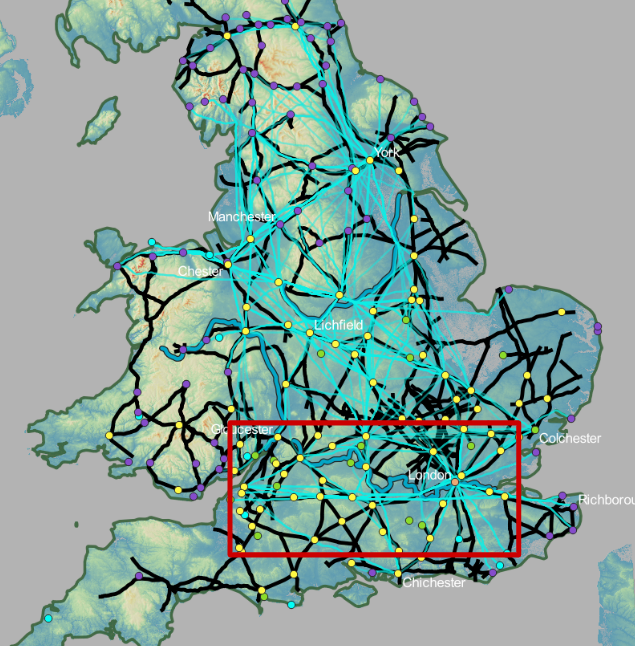

### Area of Interest

This area is of some interest because there is a high frequency of LCPs following the same route traveling East to West. However, there is not a high betweenness score for that route from Lewis nor Orengo. It is also a relatively flat area of land so there shouldn't be such a highly concentrated path there since the paths should choose the shortest distance between the two points. So it raises questions of why is this not an important road for traveling East to West from London? Or why is it that all the LCPs chose this particular route?

### Three Map View Points

|:-------------------------:|:-------------------------:|:-------------------------:|
|   View Topography of Area |   Orengo's Map |  Lewis' Map |

 

#### **View of the Least Cost Paths from a topographical standpoint**

<iframe width="600px" height="600px" src="https://mads709.github.io/south-3d-maps.github.io/" title="map"></iframe>

Looking at the terrain and landscape of this area, the first obstacle that comes to mind is the River Thames. There are only certain spots that can be crossed, and this was determined by using where the known location of Roman roads crossed the river. So for my analysis and the creation of the LCPs, the friction layer was adjusted so that the river was impossible to cross except for those specific points. Therefore when running the LCPs, they mostly chose to cross at the point closest to London to get past that rough terrain first. Then the rest of the way there is relatively flat so it could have picked several different routes that are all generally close to each other, but it would not create that thick overlapping line. Upon further investigation with the 3D map, it can be seen that there is a small change in elevation caused by the hills in the area that creates a small valley. This small valley that stretches across Britain was the most cost efficient path as it was the most level and easiest way to cross the land. It also coincides very closely to an actual Roman road, providing evidence that they decided building a road there was the most beneficial for them as well.

 

#### **View of the Least Cost Paths with the research from Lewis and Orengo**

From Orengo's map (top map), there is some evidence that part of this route from East to West is frequently used for food transportation and distribution. However, the route swings upward as it connects London to Gloucester instead of continuing straight with the LCPs. This makes sense with Orengo's work since Gloucester is another larger city and point of trade. This frequently used road is consistent with the LCPs generated so it can be seen that this route would be favored in connecting trade between the East and West. This route is a good example of an equal combination of social and economic factors, and the influence of the landscape affecting the routes for roads. It can also be seen in the partial image of the Orengo map that many of the LCPs align with the Roman roads as well as roads with a high betweenness centrality. This is because the food trade network revolves around economics and would want the most cost efficient path for trade. Therefore the most cost efficient paths for transportation would be the ones generated by the least cost path analysis.

Lewis' map (bottom map) shows more variation from his roads with high edge betweenness and the LCPs generated. There are roads that align with the LCPs but they have a lower edge betweenness score, meaning that even though these roads were good for transportation they were not as favored for communication lines between the East and West. When it comes to the communication lines for Lewis' map here, there should also be a more fortified road, meaning that the towns should have defenses. Along this route there aren't many fortified small towns so this route does not create a secure path of communication. Therefore other routes that are more favored, and this particular road has other purposes and reasons for being here.
