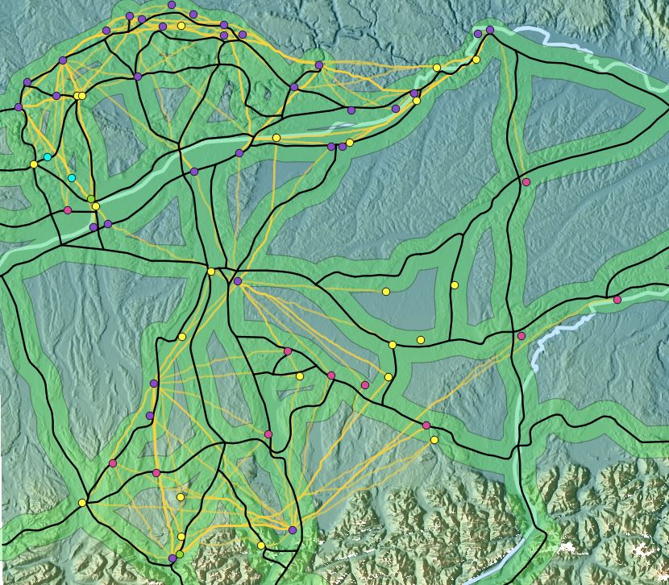

This map illustrates the LCPs from forts to the surrounding points such as other forts, settlements, and markets. This will help to see if these roads connected the forts to other places or if the main focus on the construction of these roads were to connect forts only for military purposes. In the northern part of this map, it seems that the paths are in close relation to the roads meaning that the construction of the roads were influenced by the topography. It can also be seen that the roads were definitely more focused on military use because most of the places up there are forts. There are some settlements and markets but they are placed on roads so it can be said that the Northern border is heavily protected and is mainly occupied by and for the Roman military. There is not a clear change until we looked at the LCPs generated below the Danube River. There are many LCPs that were generated that do not follow any Roman road. This can mean that the purpose of these forts and roads were not to connect other places to these forts. Instead the likely purpose of these forts were for the protection of the roads and the armies and travelers that used them. Therefore the roads were also meant for transportation across the empire and not so much for small connections between local places.
