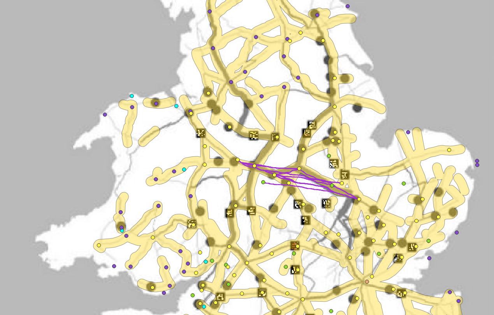

  

 

There is an area with high betweenness[^1] for the roads connecting Durovigutum to Letocetum. Lewis’ map underneath displays the high betweenness of the roads, implying that it has a higher capability of transferring information. If that is so, then the roads there are most likely created for that reason and with little regard for the topography. However with my LCPs, it can be seen that those paths also align with the roads with a high betweenness score with a few expectations. The yellow lines are the known Roman roads buffed to 5km (~3 miles) to give an allowance for the LCPs.[^2] In this image, it can be seen that the roads follow both the cultural influences as well as the topographical influences. However in this case, it is more probable that the creation of the road only focused on the cultural influences and the shortest path between each settlement instead of focusing on the topography.

[^1]: <u> High Betweenness Score </u>: When many paths run through a given edge. These paths are the shortest distance between two nodes or points. (J.Lewis)

[^2]:  It cannot be 100% accurate due to the landscape changing ever so slightly over the years.
