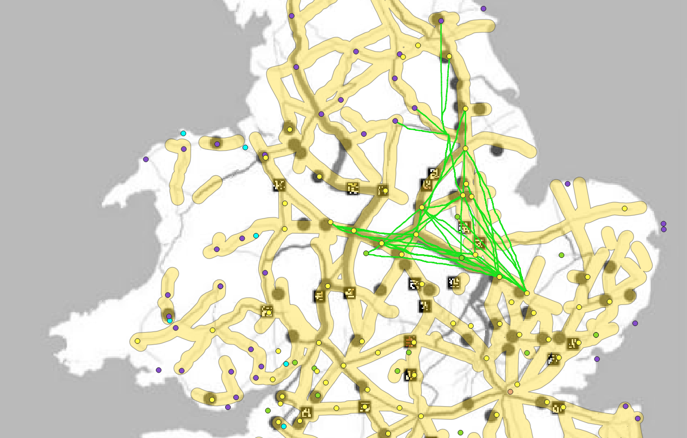

  

 

This map shows different routes that the LCPs generated from the computer that take into account the topographical information only. There is this triangle shape that is formed by the paths that go from Durovigutum to Shiptonthrope. According to Lewis’ map the road of higher importance for transferring communication is the path on the left. However there are more paths generated by my project model for LCPs for the road on the right. Meaning in this area more cultural influences are taken into consideration for the one road that is needed to connect these points. This area is relatively flat so the LCPs created the shortest path between the two points because there was not much terrain or change in elevation that impacted the routes. So the Roman did not need to be concerned with the landscape and terrain as much when constructing this road. So the focus was moved to constructing a road that connected all the important places for a secure communication line.
