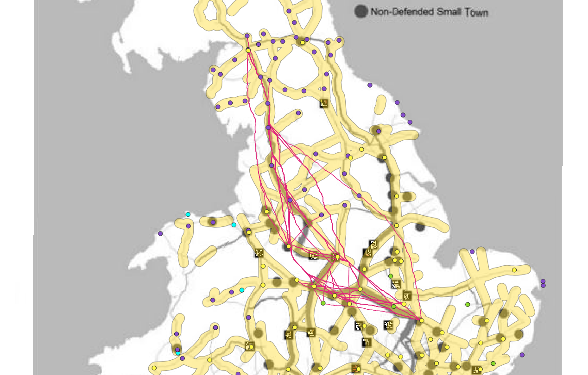

Here is Lewis’ map displaying edge betweenness[^1] among his points for defended settlements. My LCPs highlight the section of roads from Durovigutum to Uxelodum where according to Lewis those roads have a high betweenness score.[^2] Therefore this section of roads are important to the communication system between these defended small towns. This means that these roads have some influence by cultural factors, and the LCPs that I generated will help to determine if there was also topographical influence from the landscape in the creation of the roads. By looking at the comparison between the known Roman roads, Lewis’ roads, and the LCPs, it can be concluded that the Romans did take into consideration the landscape for ease of transportation as most of the LCPs lay within the yellow buffed roads. That being said, another conclusion can be drawn that Lewis’ map shows the increasing importance of these roads and the continual use of them. My LCPs provide conclusions on the creation process of these roads. Combining my research with Lewis', it can display the purpose of these roads as well as which of these paths became the main roads in Roman Britain.

[^1]: <u> Edge Betweenness</u>: The number of shortest paths in the graph that pass through a given edge (J.Lewis)
[^1]: <u> High Betweenness Score </u>: When many paths run through a given edge. These paths are the shortest distance between two nodes or points. (J.Lewis)
