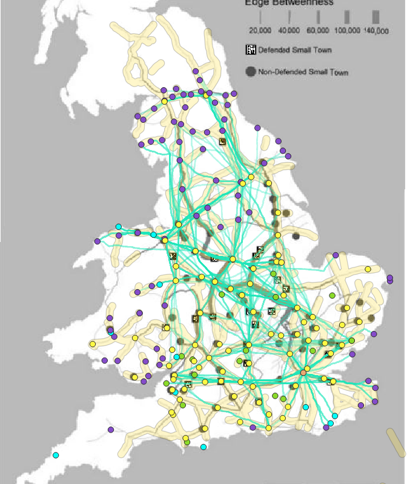
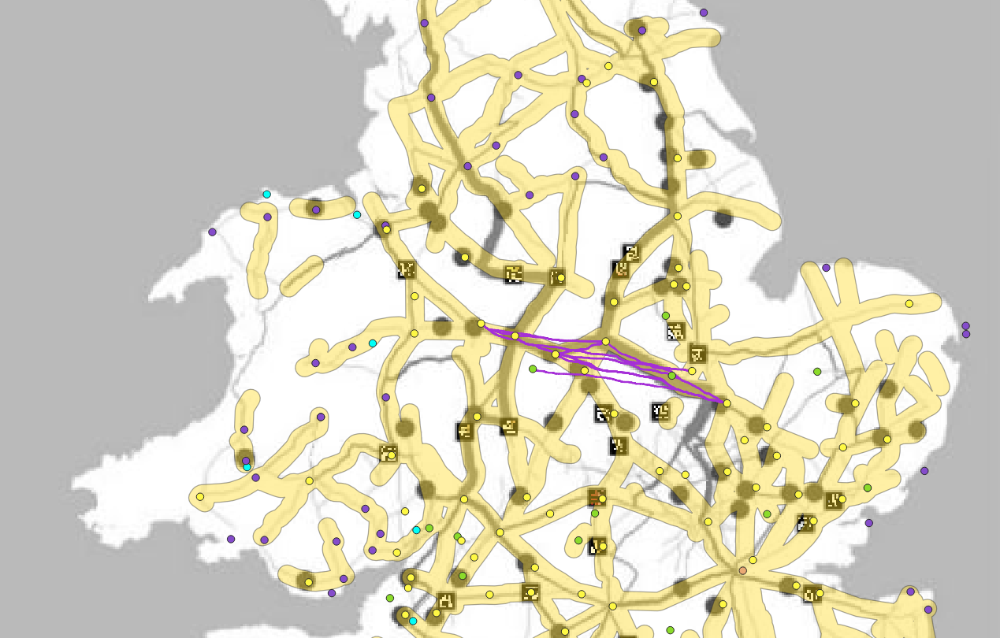
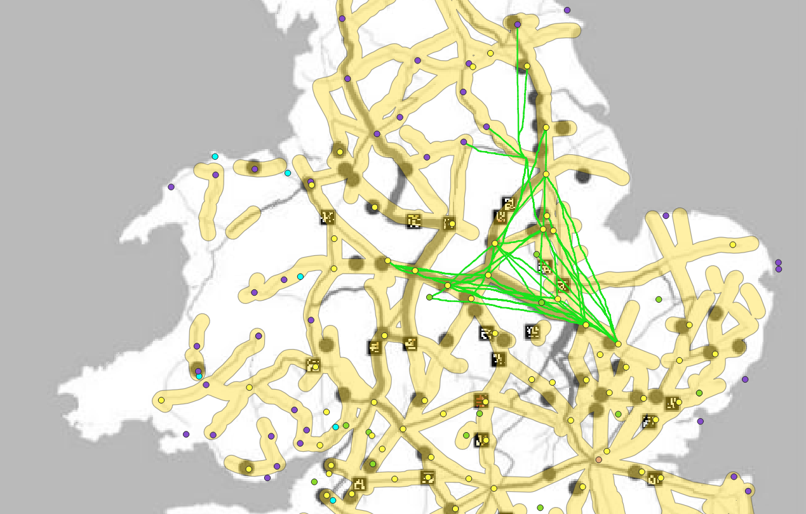
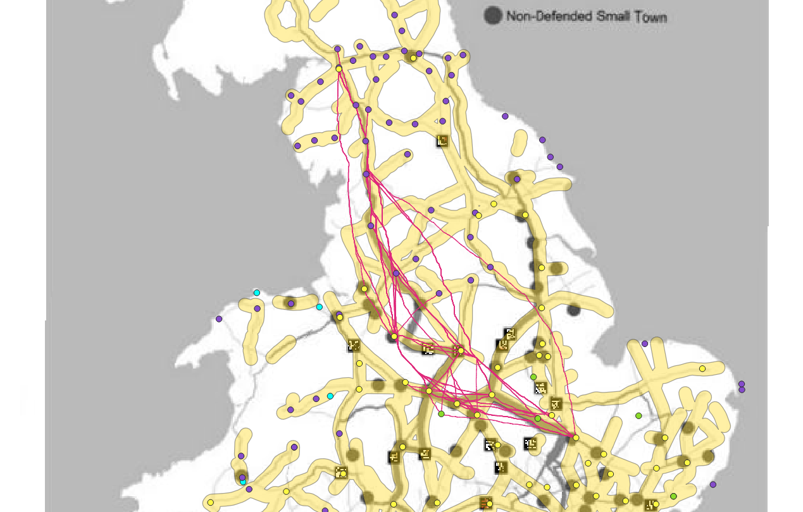

This map displays the LCPs generated that were overlapped with the roads containing high betweenness scores from Lewis. This allowed for an analysis of roads that were suspected to be main roads in Roman Britain based on topographical influence versus Lewis’ roads that are main roads for transferring information across Roman Britain. Looking at the map, the turquoise lines that appear to be thicker or more prominent are the paths that have several paths overlapping. This means that based on the topography of the area those are the best paths to take between settlements based on the cost efficiency. Now there are several areas where there are these thick LCPs and no thick black lines from Lewis’ map. This leads to the conclusion that these paths were the more optimal paths to take across Roman Britain, but are not optimal for communication purposes. However, they could be more ideal paths for other purposes such as paths for trade. The paths that do overlap with the thick black lines of Lewis’ map do help to determine the use and the planning that went into these roads. These relates to Lewis’ two hypotheses he had for his research:

> (1) Defended small towns were well integrated within the road network for the efficient transfer of information.\\
(2) Defended small towns were located on roads that were important for controlling the flow of information across the road network.

The LCPs that overlap with his roads show that the Romans took into consideration the landscape while constructing these roads keeping in mind future uses for them. The primary function when they were first constructed was for the military so they could traverse the landscape and move armies with ease. However they must've thought of future uses for these roads, and constructed them so that they could have the most optimal paths between points of importance like future settlements. Then to secure these paths, there was cultural influence being the defended small towns. They were to create a secure and cost efficient network of roads for transferring information.

|:-------------------------:|:-------------------------:|:-------------------------:|
|  Lewis' Map with My LCPs frmo Durovigutum to Letocetum | <a href=""> <a/> Lewis' Map with My LCPs frmo Durovigutum to Shiptonthrope |  Lewis' Map with My LCPs frmo Durovigutum to Uxelodum |
