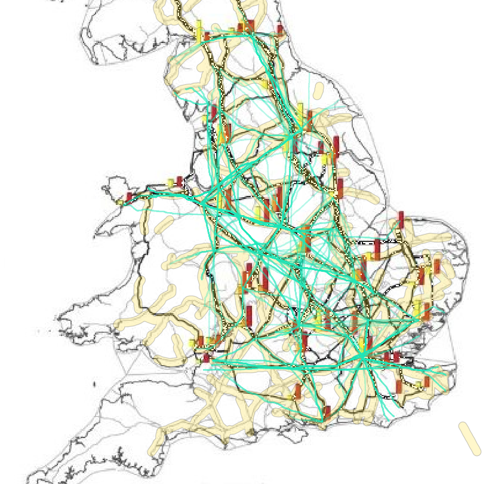

 

 <a href="https://mads709.github.io/orengo-web-map.github.io/"> <b> Click Here for Interactive Map </b> </a> 

 

Orengo’s maps have similar analysis as they also display Spatial Network Analysis (SpNA) betweenness centrality[^1]. This map above uses Orengo’s Middle Roman period map of Roman Britain, displaying SpNA betweenness centrality routes between all sites with new food plants. This map will help take a look at how the LCPs generated from topographical data relate to the routes with high betweenness[^2] for roads within the food trade network in Roman Britain. The thicker black lines on Orengo’s map display the routes with higher betweenness centrality, which means that those routes were more common for transporting food between the plants and settlements. When comparing the LCPs that overlap with those routes of higher betweenness, we see which routes were more optimal overall because there is a high influence of cultural and topographical influence. Meaning those routes take into account the best routes for trade and transportation of food as well as the best routes with the lowest cost of energy for traversing the landscape. There are some obvious prominent routes that traverse across England going from East to West, but not as many that go from North to South. This gives the impression that there was more consideration of the landscape for optimal routes going East to West. That could also be because there is more difficult terrain like rivers or more changes in elevation that would affect the cost of energy for transportation routes. When transporting goods such as food, people are more likely to choose routes that have the lowest energy cost and are the fastest paths from point A to point B. Therefore the routes that go South to North, must not have as much differences in terrain or elevation. They just took roads that had the shortest route from point A to Point B because the topography was not a big factor.

[^1]:<u> Betweenness centrality</u>: Based on the shortest path between a node and other nodes. If many shortest paths run through a node, it has a high betweenness centrality.
[^2]: <u> High Betweenness Score </u>: When many paths run through a given edge. These paths are the shortest distance between two nodes or points. (J.Lewis)
