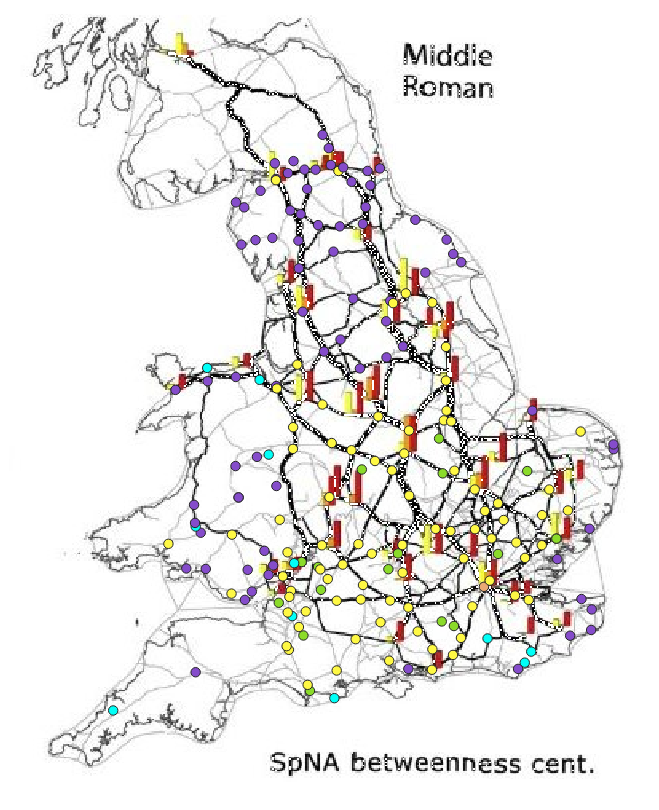

This map displays one of Orengo’s maps from The seeds of commerce: A network analysis-based approach to the Romano-British transport system. This particular map illustrates the Spatial Network Analysis (SpNA) betweenness centrality [^1] routes between all sites with new food plants in the Middle Roman time period. The thicker lines represent the roads with a higher betweenness centrality score and as the lines thin out, the score lowers.  This shows the paths of more importance in relation to the food trade and disbursement network. The betweenness centrality score is also showing how culturally influenced the roads were in this time period.

Both the influencing factors from the two maps were culturally driven: (1) an information network and defenses, (2) the food trade and disbursement network. The maps and paths that I have generated only account for the topographical influence. Only using the elevation and friction of the terrain to determine the best paths between the settlements, forts, markets, and mines. My least cost paths will be overlaid on top of the other two maps to compare their roads with high betweenness. This will give more insight into the thought around the creation of the Roman roads in Britain.

[^1]:<u> Betweenness centrality</u>: Based on the shortest path between a node and other nodes. If many shortest paths run through a node, it has a high betweenness centrality.
