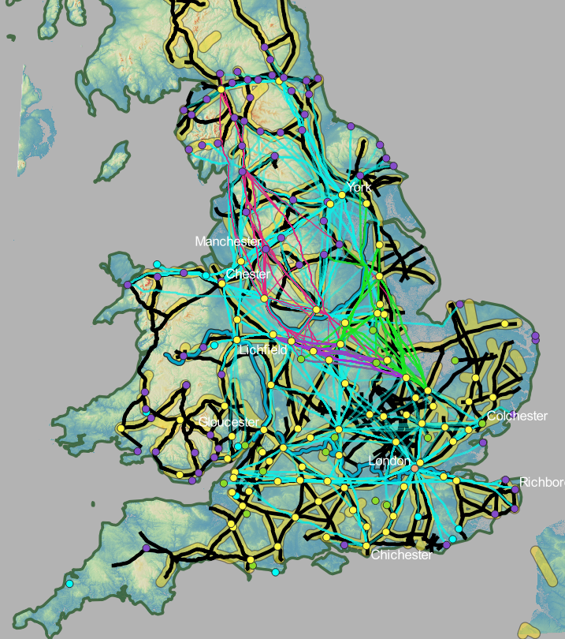

  

This map gives a look into all the LCPs in relation to the Roman roads, which are the black lines. The purple buffed lines on top of the black lines are the allowance given for the comparison between the roads and my least cost paths. The yellow buffed lines give an allowance of 5 km (~3 miles)[^1]. This gives insight to see where the LCPs show high probability of a road because the thicker lines are where multiple LCPs share the same path. It also shows which roads were heavily influenced by the topography of the area because those thick lines also overlap with the purple buffed roads. It can be seen that many of the roads, especially the main roads that go North to South and East to West share similar routes to the LCPs that were generated. Therefore roads that are meant for long distance travel across the territory followed the natural landscape for the most optimal path. This could be because when traveling long distances, it is best to pick the quickest and most easily navigable paths. This would be smart especially for thinking of future purposes for these roads, which would be for transferring information and transporting different goods all over the territory.

[^1]:  It cannot be 100% accurate due to the landscape changing ever so slightly over the years.

 

<iframe width="800px" height="600px" src="https://mads709.github.io/whole-3d-map.github.io/" title="map"></iframe>

 

---
---
 

Click on the maps below to look at the least cost paths in the North and South.

 | \\ LCPs and Roads in the North |  LCPs and Roads in the South |
