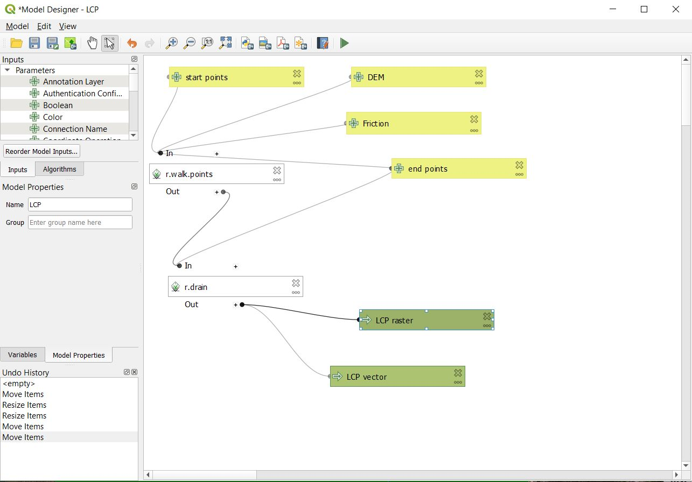

### *Methodology*
A least cost path is the shortest and quickest route between two points that uses the least
amount of energy or resources for the movement. In order to create Least Cost Paths (LCPs) as
accurately as possible for this project I created a project model in QGIS. QGIS is a geographic information system computer program that does provide its own least cost path analysis plugin, however it only generates LCPs based on raster layers like
an elevation map. This is a very basic method that yields results that are acceptable for smaller
 projects and simple cases where it is only a small factor. This project requires a method that could generate more
accurate results since the LCPS are the main component and factor that is being analyzed for this project. Therefore a least cost path
algorithm needed to be created that used other algorithms from R (a computer programming language)
and different raster layers that contribute to cost analysis and walk times/cost.
This called for the use of r.walk, r.drain, as well as a digital elevation raster layer and
a friction cost raster layer.

 
 

### *Project Model*

Above is an image of the project model that was created for this least cost path analysis.
The inputs for the analysis were the start points, end points, Digital elevation model (DEM),
and the Friction cost raster layer. These inputs were used to calculate the first part
of this model, r.walk. R.walk is an algorithm that computes the cumulative cost for the
movement between two points. In order for this algorithm to make this computation, it
needs the elevation model and friction costs of the area. The elevation model gives the information
of the slope therefore stating the cost that it will take to walk between the changing elevation.
The friction cost will help to determine the cost it takes to walk through the area as if it were
a flat surface. For example:
* The cost for movement in an area that is flat and swamp-like will be harder to move through
and would cause a person to walk slower. This would have a greater cost to walk through.
* The cost of movement through an area that is flat with short grass, similar to a golf course,
would allow someone to move faster. This would have a lower cost to walk through.

These two inputs give the r.walk algorithm lots of important information about the
landscape, which is exactly what is needed for this project. So from a start point the
cumulative cost layer can be created with the information obtained from the elevation model
and the friction cost layers. This cumulative cost layer will be generated out to the end
points that were specified in the inputs, and then this will be used in the next
algorithm, r.drain.

R.drain uses the cumulative cost layer and the movement direction layer
that was generated from the r.walk algorithm. R.drain creates a least cost path essentially as
it creates a path of flow through the cost surface that was created before. R.drain was
mainly designed for tracing the flow of water or drainage through an elevation map. This
means that it would create a good least cost path because it is tracing the flow of water which
would show the quickest and simplest path it would take as it flows down a hill or mountain.
Therefore it would also calculate the quickest, shortest, and lowest cost path from one
point to another. The algorithm uses the end points and layers generated from r.walk
to create the least cost path back to the start point. This was the method used to
create the most accurate least cost paths for this project.

 

### *Least Cost Paths*

#### **Roman Britain**
The maps here represent the three different ways the Least Cost Paths (LCPs) were calculated: \\
(1) LCPs between different forts in the area\\
(2) LCPs between forts and every other point in the surrounding area\\
(3) LCPs between settlements and every other point in the surrounding area

 

The first types of paths were generated because the first function and purpose for
the Roman roads were for military use. They helped to transport armies as well as
established important communication lines for the military campaign. This way the
paths generated between the forts could be analyzed and compared to the actual Roman
roads. This helped to understand if most of the roads were created for military
transport and how much the Romans used the natural flow of the landscape to construct
the roads. Then if a path was way off from the known Roman road, why was the road
constructed in such a way that was not cost efficient? What was the purpose of that
road?

 

The second type of paths generated is to see how the roads incorporated markets
and settlements. This helped to explain why some LCPs displayed different
paths than the roads.

 

The third type of paths generated is to look at the roads that may have been constructed
after the military need for them. When the roads started to be constructed to connect
settlements and markets. This helped to analyze how much those types of Roman roads
were constructed following the flow of the landscape for the most cost
efficient transport or if they were just concerned with the shortest path regardless
of terrain and topography influence.

There are several maps that represent different LCPs that were generated with the
method mentioned above. However, there is also analysis here on topographical influences
of roads versus other cultural influences on the roads. This was accomplish by using the
research from Joseph Lewis and Hector Orengo. I used their research and maps that
they generated to look at the high betweenness centrality between roads for transferring
information and food trade and disbursement.\\
Their maps that they generated are overlapped onto my maps with the generated LCPs.
This allows for an easy comparison between their research and the research conducted
in this project. It highlights the different paths and roads with high betweenness
centrality which displays a level of importance for that section of road for communication
or trade and commerce. Looking at the LCPs generated from this project, it can be
concluded which roads are also influenced by the topography of the area and which roads
were more influenced by social and economic aspects.
