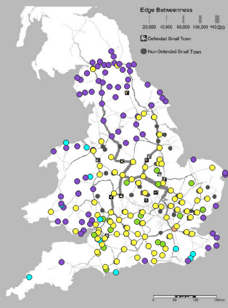
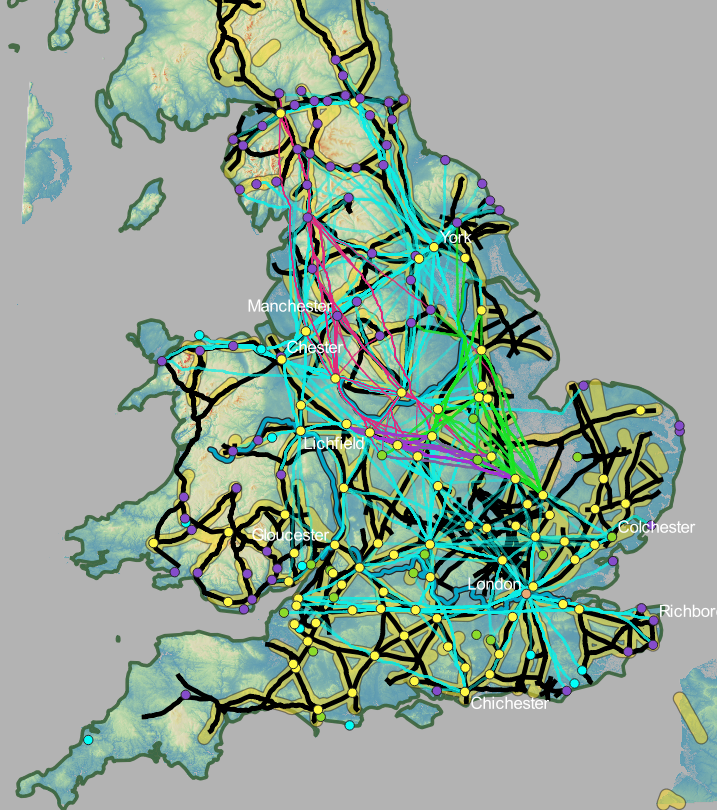
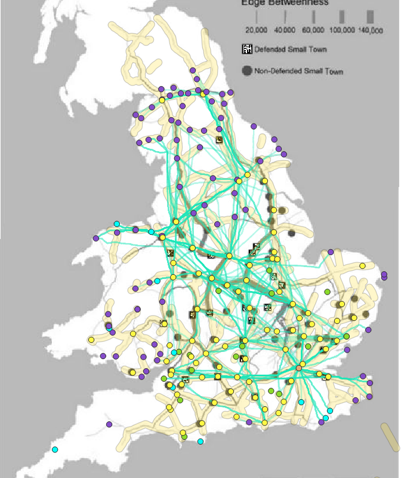
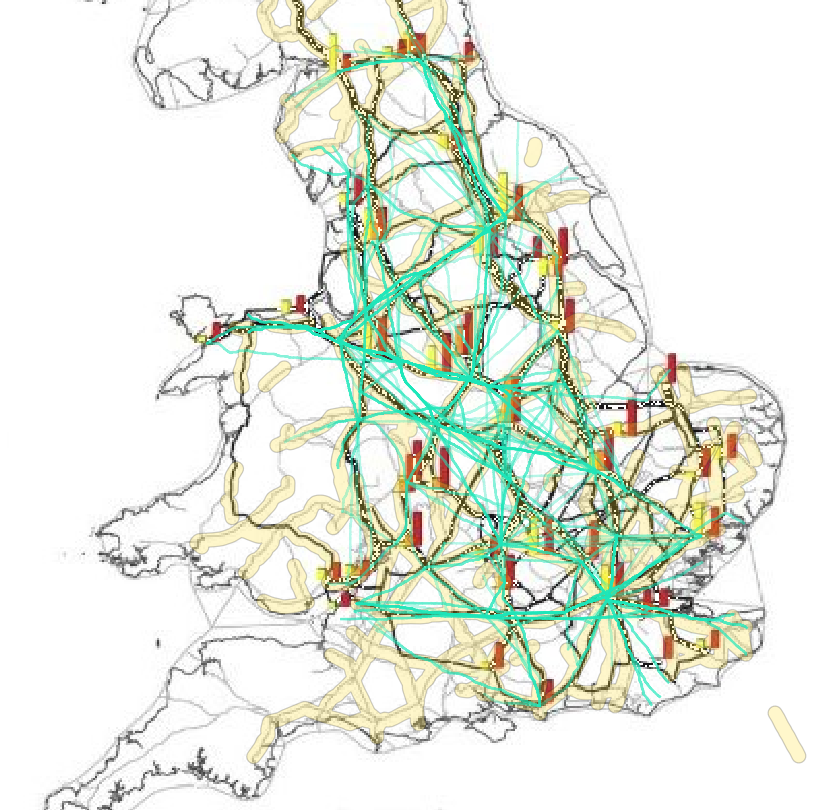
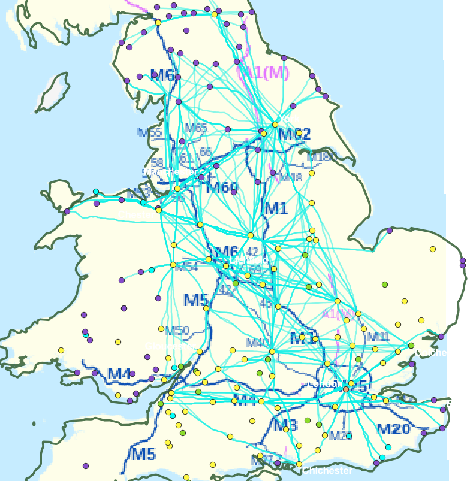

On this page you can explore the different the maps and learn about the influences the terrain and social issues, such as communication routes and food transportation network, had on the Roman roads. The map below is a web map that can be used to view relationships between the different layers (i.e. the different least cost paths, Roman roads, and maps illustrating communication routes and food distribution routes). Using the scroll bar at the bottom of the box and scrolling to the right, you can find the legend. The legend displays the different layers that are a part of this map. You can uncheck or check the boxes to change the visibility of the different layers. Below this web map is a collection of maps, which display different points of interest to highlight. By clicking on the images of the maps, you can find out more about the map and topic.

## Map

<iframe width="800px" height="600px" src="https://mads709.github.io/roman-road-comp.github.io/" title="map"></iframe>
#### <a href="https://mads709.github.io/roman-road-comp.github.io/"> Full Screen Experience </a>

 

## Map Comparisons

Click on the maps to learn more about these areas and influences on the roads. These maps explore the influences of topography, communication networks, and food networks on the roads.
* <a href=""> **Lewis and Oregno's maps** </a>: This gives a brief introduction regarding the use and purpose of those particular maps in this analysis.
* <a href=""> **Roman Britain Least Cost Paths** </a>: These maps explore the terrain of Roman Britain, and contains analysis for the influences of the roads. It explores different areas of interest and discusses possibilities for why certain least cost paths took a particular route.
* <a href=""> **Communication and Topographical Influences** </a>: These maps explore particular routes that were common for transferring information across Britain. It compares those routes with the least cost path to aid in understanding the influences and thought process of the Romans during the construction of the roads.
* <a href=""> **Food Transportaiton Network and Topographical Influences** </a>: This map compares the routes that were commonly used to transport and distribute food across Roman Britain with the least cost paths. These maps look at the similarities between the roads and the least cost paths, and the conclusions about them.

|:-------------------------:|:-------------------------:|
| Lewis' and Orengo's Maps |  Roman Britain Least Cost Paths|
|  Communication and Topographical Influences |  Food Transportation Network and Topographical Influences|

|
Modern highway map with Roman roads
